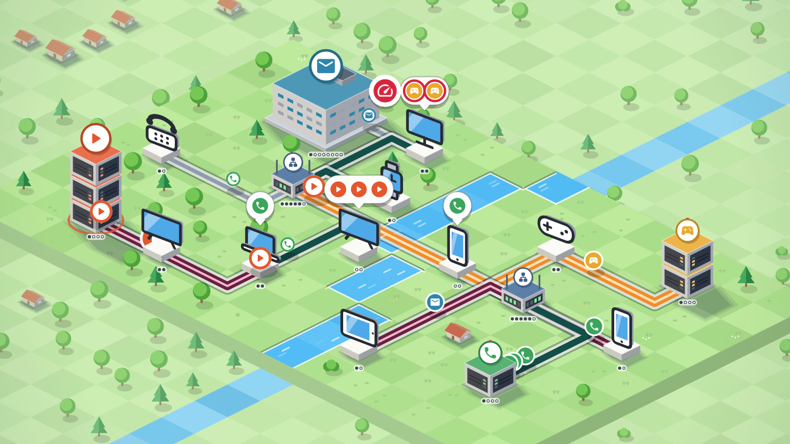
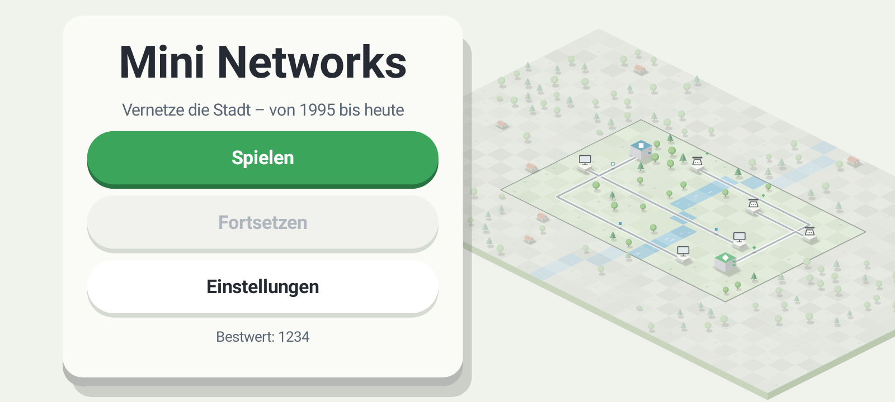
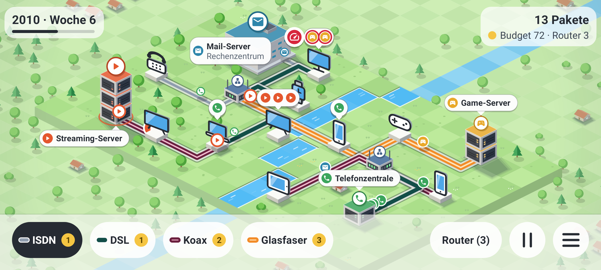
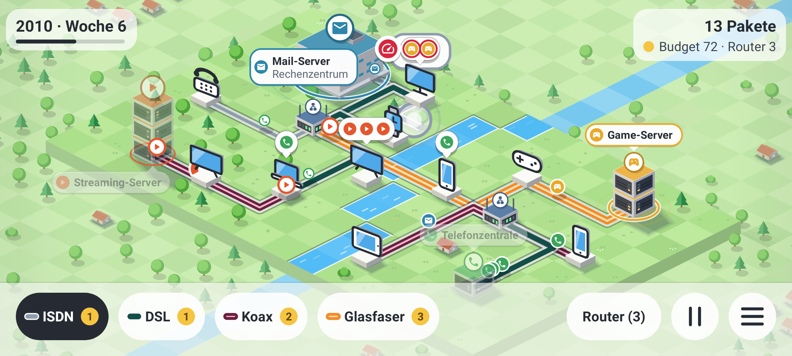

# Mini Networks

Natives Android-Spiel (Kotlin, ohne Engine) im Stil von Mini Metro / Mini Motorways – nur mit Netzwerken:
Geräte fordern Dienste an, der Spieler verlegt Kabel von ISDN bis Glasfaser und hält Bandbreite und Ping im Griff.

- **Plan und Spieldesign:** [`docs/PLAN.md`](docs/PLAN.md)
- **Stilstudie (4 Looks) und Prototyp-Screenshots:** [`docs/style-explorations.html`](docs/style-explorations.html)





```bash
echo "sdk.dir=$ANDROID_HOME" > local.properties
./gradlew testDebugUnitTest assembleDebug
adb install app/build/outputs/apk/debug/app-debug.apk
```

**Steuerung:** Von Gerät/Server/Router zu einem anderen Knoten ziehen = Kabel legen ·
Kabeltechnik unten links wählen · Kabel antippen = auf gewählte Technik upgraden (gleiche Technik = entfernen) ·
„Router“ und dann ein freies Feld antippen · „Pause“ oder Zurück öffnet das Pause-Menü ·
der flache Übersichtsmodus, Ton, Haptik und eine Farbenblind-Palette stehen in den Einstellungen.
Das Spiel speichert automatisch beim Pausieren und Verlassen; „Fortsetzen“ im Hauptmenü lädt den Stand.

**Welches Gerät braucht welchen Server?** Jeder Dienst hat seinen eigenen Server-Typ (Mail-Server, Telefonzentrale,
Game-Server, Streaming-Server, Video-Server, Kamera-Cloud, Backup-Server); ein Rechenzentrum ist nur die höchste
Ausbaustufe eines dieser Server, kein eigener Typ. Jeder Server trägt ein Namensschild mit dem Symbol seines Dienstes –
demselben, das die Anfragen der Geräte zeigen. Zieht man ein Kabel von einem Gerät (oder tippt es an), leuchten die
passenden Server auf und die übrigen treten zurück; die Legende („Was ist was?“) listet Gerät → Server.



