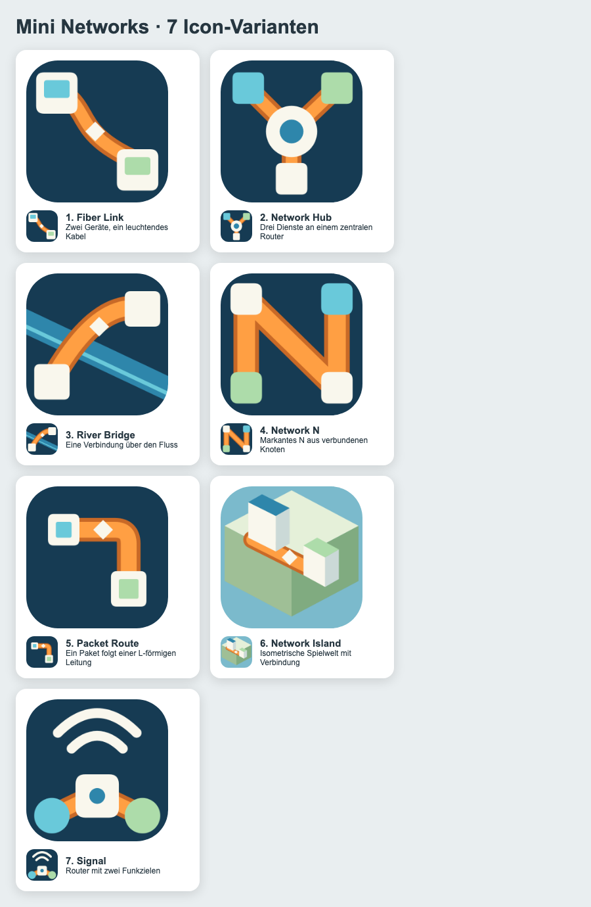

# Mini Networks: sieben Icon-Varianten

| Nr. | Idee | Datei |
|---:|---|---|
| 1 | Fiber Link: zwei Geräte, geschwungene Glasfaser | [PNG](01-fiber-link.png) · [SVG](01-fiber-link.svg) |
| 2 | Network Hub: drei Anschlüsse am Router | [PNG](02-network-hub.png) · [SVG](02-network-hub.svg) |
| 3 | River Bridge: Verbindung über einen Fluss | [PNG](03-bridge.png) · [SVG](03-bridge.svg) |
| 4 | Network N: Netzwerk-Monogramm | [PNG](04-network-n.png) · [SVG](04-network-n.svg) |
| 5 | Packet Route: Paket auf einer Leitung | [PNG](05-packet-route.png) · [SVG](05-packet-route.svg) |
| 6 | Network Island: isometrische Spielwelt | [PNG](06-isometric-island.png) · [SVG](06-isometric-island.svg) |
| 7 | Signal: Router mit Funkzielen | [PNG](07-signal.png) · [SVG](07-signal.svg) |

Diese sieben Varianten dokumentieren die frühere Exploration. Das aktuelle Icon verwendet die ursprüngliche Grafik „Bridge Link“ aus `tools/icon/bridge-link-source.png`, ausgewählt anhand der Bildvorlage. `tools/icon/build_icon.js` erzeugt daraus die Android-Grafik und das 512-px-Store-Icon. `tools/icon/generate.js` erzeugt zusätzlich die sieben Varianten neu.
